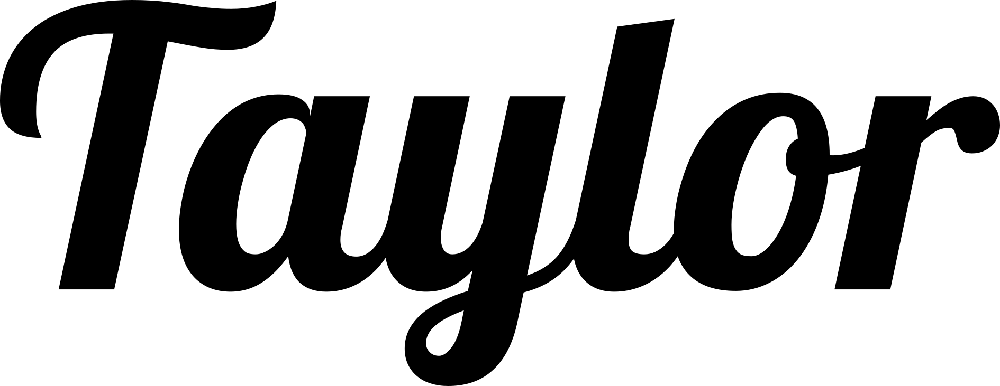

<h1 align="center">
  <br>
  <picture>
  <source media="(prefers-color-scheme: dark)" srcset="assets/images/logo.png" alt="Taylor logo" width="400">
  
  </picture>
</h1>
<h4 align="center">Made for Games</h4>


[](https://buildkite.com/oequacki/taylor)


[Website](https://taylormadetech.dev) | [Cheat Sheet](https://taylormadetech.dev/documentation/tutorials/cheat_sheet/) | [Documentation](https://taylormadetech.dev/documentation/taylor/latest/) | [Try it Out Online](https://playground.taylormadetech.dev/)

## What's This?

Taylor is a game engine I've built using [mruby](https://mruby.org/) and
[raylib](https://www.raylib.com/). I'm trying to build a very simple way for
people to get into game development. This is trying to replicate the simplicity
of [QBasic](https://wikipedia.org/wiki/QBasic) but with a more of a modern approach.

## Getting Started

Check out my tutorial over on the [official Taylor
website](https://www.taylormadetech.dev/documentation/tutorials/getting_started/).

## Examples

If you'd like to see some examples, check them out on the [online playground!](https://playground.taylormadetech.dev/)

## Compile Yourself!

> [!NOTE]
> Currently there are no instructions for Windows and OSX.

### Linux

1. Install the build dependencies:  
    <details>
      <summary>Fedora</summary>
      
      ```console
      $ sudo dnf groupinstall "Development Tools" "Development Libraries"
      $ sudo dnf install ruby mingw-gcc-c++ wine
      ``` 
    </details>
    <details>
      <summary>Ubuntu/Debian</summary>
      
      ```console
      $ sudo apt-get install build-essential ruby g++-mingw-w64 wine
      ```
    </details>
3. Run `bundle install` to install all the required dependencies
4. You should now be able to just run `bundle exec rake` and wait a few seconds.
   Once the compilation finalises, the binary will be located on
   `dist/linux/debug/taylor`.
5. **Optional**: if you want the nice command line interface, you'll need to run this script:  
    ```console
    $ ./dist/linux/debug/taylor ./cli-tool/cli.rb
    ```

Additionally, You may want to add the Taylor executable to your PATH so you can call it from anywhere. You can 
use the following shell script as a base, it'll also run the CLI for you:

```shell
#!/usr/bin/env bash
TAYLOR_PATH=/home/sean/code/taylor/ # Change to where you cloned the repo

"$TAYLOR_PATH/dist/linux/debug/taylor" "$TAYLOR_PATH/cli-tool/cli.rb" "$@"
```

Save it as `taylor` and make it executable (`chmod +x taylor`), then add this on the end of your `.bashrc`:

```bash
export PATH="$HOME/code/taylor:$PATH" # Change the path to where you saved the shell script
```

## Docker

To build all the Docker images you can run the following command:

```
$ bundle exec rake docker:build:all
```

If you also want to compile the mruby and raylib dependencies yourself there are
Docker images for that too, just run:

```
$ bundle exec rake docker:build:{mruby,raylib}
```

## License

Taylor is free and open-source, licensed under the [MIT license](https://github.com/HellRok/Taylor/blob/main/LICENSE).
